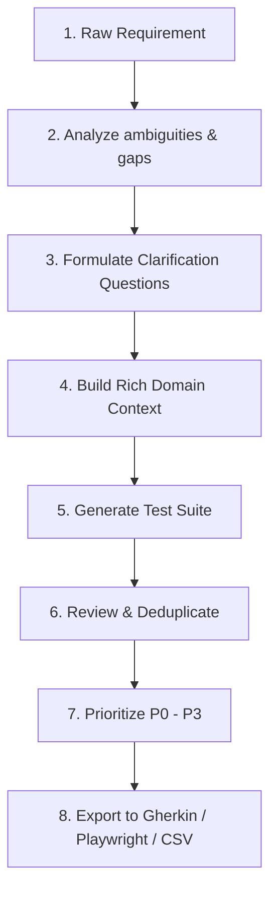

# QAMate 🚀

> **Ask first. Think second. Generate last.**

### ❄️ QAMate Roadmap Status

- **Architecture**: ✅ Frozen (v1)
- **Roadmap**: ✅ Frozen (v1)
- _New features require implementation experience before roadmap changes._

QAMate is **not** another AI chatbot or passive code generator. It is an open-source, AI-powered **Senior QA Thinking Assistant** built for QA engineers who want to think deeper, verify assumptions, and build high-quality, professional test coverage rather than just generating quantity.

---

## 🌟 The QAMate Philosophy

Most AI testing tools follow a simplistic path:
`Requirement ➔ Generate Test Cases`

This often results in shallow, redundant, or incorrect test cases that miss boundary rules and implicit behaviors. QAMate enforces a structured, professional QA process:



---

## 🛠️ Repository & Tech Stack

This project is organized as a high-performance **monorepo** configured for developer velocity, strict typing, and code formatting consistency.

- **Language**: [TypeScript](https://www.typescriptlang.org/) (Strict mode, ES2022 targets)
- **Monorepo Orchestration**: npm Workspaces (configured for both `pnpm` and `npm`)
- **Linting**: [ESLint v9 Flat Configs](https://eslint.org/)
- **Formatting**: [Prettier](https://prettier.io/)
- **Testing**: [Vitest](https://vitest.dev/)

### Folder Structure

```
QAMate/
├── .github/
│   └── workflows/
│       └── ci.yml               # Automated CI (lint, build, test)
├── docs/
│   └── architecture.md          # Detailed architectural module layout
├── packages/
│   ├── engine/                  # Core Business & AI Logic (Independent package)
│   │   ├── src/
│   │   │   ├── domain.ts        # Tactical DDD Aggregates, Entities, and Value Objects
│   │   │   ├── interfaces/      # Contract interfaces for the 8 core modules
│   │   │   └── types.ts         # General domain types
│   │   └── package.json
│   ├── shared/                  # Common utilities, loggers, and errors
│   │   └── src/index.ts
│   └── vscode-extension/        # Stub for the VS Code editor integration
│       └── src/index.ts
├── eslint.config.js             # Shared lint rules
├── tsconfig.json                # Root TSConfig using project references
└── tsconfig.base.json           # Base typescript configuration
```

---

## 🚀 Getting Started

### Prerequisites

- Node.js `>=20.0.0`
- `npm` or `pnpm`

### Installation

Clone the repository and install dependencies from the root directory:

```bash
# Using npm
npm install

# Or using pnpm
pnpm install
```

### Script commands

The project commands are run from the monorepo root:

| Command            | Action                                                              |
| ------------------ | ------------------------------------------------------------------- |
| `npm run build`    | Builds all packages incrementally via TypeScript Project References |
| `npm run clean`    | Cleans previous TypeScript build outputs                            |
| `npm run lint`     | Runs ESLint analysis across all workspace packages                  |
| `npm run lint:fix` | Automatically repairs format/lint issues                            |
| `npm run format`   | Runs Prettier to format source files and markdown                   |
| `npm run test`     | Runs the test suites using Vitest                                   |

---

## 📐 Architecture & DDD Design

The core of QAMate is designed using **Domain-Driven Design (DDD)** to ensure strict business boundaries.

- **Independent Core Engine**: The `@qamate/engine` package contains the business domain models and module contracts. It knows nothing about React, VS Code APIs, or specific LLM SDKs.
- **Provider Agnostic**: All AI actions are executed through the `ILLMProvider` interface. You can swap between Gemini, OpenAI, Anthropic, or local models (via Ollama/Llama.cpp) without editing engine logic.
- **Thin Extension Client**: The VS Code Extension (`@qamate/vscode-extension`) is a client that reads editor buffers, submits them to the engine, and renders the state of the active `Conversation` aggregate.

For an in-depth breakdown, read the [Architecture Documentation](file:///d:/QAMate/docs/architecture.md).

---

## 🤝 Contributing

We welcome contributions to QAMate! Please read our [Contributing Guide](file:///d:/QAMate/CONTRIBUTING.md) to understand our coding standards, branch policies, and PR review workflow.

---

## 📄 License

This project is open-source and licensed under the [MIT License](LICENSE).
