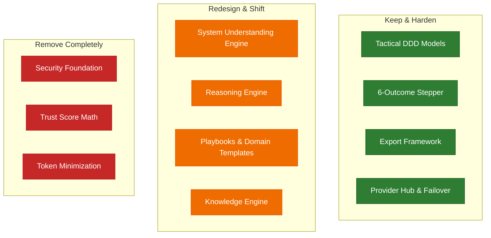

# QAMate Product Architecture Review
**CTO-Level Evaluation of Product Philosophy, Architectural Alignment, and Strategic Direction**

---

## Executive Summary
This architecture review evaluates the product philosophy and high-level design of **QAMate** to ensure its technical foundation supports its long-term vision. 

Over multiple iterations, QAMate has grown incrementally. While the tactical domain models and the multi-step outcome pipeline are conceptually sound, the core engine has accumulated accidental complexity. It has begun solving generic implementation problems (e.g., token minification, regex redaction) and competing with AI by codifying "QA reasoning" in brittle, rule-based TypeScript heuristics.

This document identifies architectural misalignments, recommends components to keep, modify, or remove, and outlines a strategy to shift QAMate from *competing with AI reasoning* to *specializing AI for structured QA workflows*.

---

## 1. What is QAMate trying to become?
QAMate is trying to become a stateful, native IDE-integrated **Senior QA Thinking Assistant** and **QA Reasoning Workspace**. 

Its core mission is to shift the role of the QA engineer from a passive generator/manual executor of bulk, low-value tests to a **Quality Architect**. It does this by enforcing a disciplined, human-in-the-loop QA thinking process:
* **"Ask first. Think second. Generate last."**
* Transforming ambiguous software requirements into structured, queryable domain models.
* Designing a testing strategy before generating code.
* Compiling high-confidence, traceable, and deduplicated QA deliverables (Gherkin feature files, Playwright scripts, and manual test suites).

---

## 2. Is the current architecture aligned with that vision?
**Partially.** 

### Where it is aligned:
* **Monorepo Topology**: Separating the stateless core engine (`@qamate/engine`) from the visual client interfaces (`@qamate/vscode-extension`, CLI, and future Web UI) ensures that business logic remains portable and decoupled from IDE APIs or frontend frameworks.
* **Tactical Domain-Driven Design (DDD)**: Modeling key entities and aggregates (e.g., `Conversation`, `TestStrategy`, `TestCase`, `QAArtifact`) provides a stateful, traceable ledger of human-in-the-loop decisions.
* **The 6-Outcome Pipeline**: The progression of `Understand` ➔ `Prepare` ➔ `Plan` ➔ `Generate` ➔ `Review` ➔ `Deliver` represents a structured engineering workflow rather than a simple chat interface.

### Where it is misaligned:
* **Brittle Heuristics in the Core**: The core reasoning modules (`SystemUnderstandingEngine` and `QAReasoningEngine`) rely on string-matching heuristics and rigid, hardcoded conditions to reconstruct software architectures and recommend test exclusions.
* **Scope Creep into Infrastructure Middleware**: The engine has absorbed responsibility for low-level tasks like token budget enforcement, regex-based secret redaction, and prompt minification.
* **Heuristic Gatekeeping**: The system blocks the user based on arbitrary mathematical quality formulas (e.g., requirement score calculations) rather than letting the human engineer override or guide the process.

---

## 3. Which parts are solving implementation problems instead of product problems?

| Component | What it does | Why it is an implementation (not product) problem |
| :--- | :--- | :--- |
| **`SecurityFoundation`** | Runs regex patterns to redact passwords/API keys and detect basic prompt injections. | Secret redaction and prompt injection prevention are generic gateway/middleware or client integration concerns. They do not belong in the core QA domain model. |
| **`EfficiencyEngine` & `TokenOptimizer`** | Minimizes prompt size by stripping code comments and spaces; estimates token usage and USD costs. | Context optimization is a transient execution concern. Stripping comments and formatting from requirement specs can actually strip vital semantic context (e.g., inline mock data or design notes) that LLMs need. Furthermore, with modern large-context models, token minification is an outdated micro-optimization. |
| **`TrustFramework`** | Computes a "trust score" via hardcoded penalty rules (e.g., deducting `0.08` per missing gap and `0.05` per ambiguity). | Quantifying trust using arbitrary arithmetic coefficients is an implementation shortcut. It attempts to mathematically approximate a subjective, semantic quality evaluation that is better handled by AI validation gates and human reviews. |
| **`RuleBasedDomainDetector`** | Scans requirement text for static keyword lists (`stripe`, `hotel`, `auth`) to assign playbooks. | Brittle string matching is an implementation workaround for domain-specific templates. It fails to generalize to complex, custom, or multi-domain enterprise applications. |

---

## 4. Architectural Lifecycles: Keep, Change, or Remove?



### Which parts should remain?
* **DDD Aggregate Boundaries (`domain.ts`)**: The stateful aggregates (`Project`, `Conversation`, `TestStrategy`, `TestCase`) must remain. They define the structural ledger of QA analysis and guarantee auditability.
* **AI Provider Gateway Interface (`ILLMProvider`)**: Swapping between Gemini, Anthropic, OpenAI, or local Ollama instances is a core product value proposition.
* **Failover & Escalation Logic (`AIOrchestrator`)**: The failover chain (Local/Cheapest ➔ Cloud Cheap ➔ Cloud Premium) ensures reliability, but should be simplified to focus on connectivity and routing rather than budget counting.
* **Export Serialization (`ExportEngine`)**: Translating a structured `TestCase` array into test runner assets (Playwright, Gherkin) is a core delivery step.
* **Jira & ADO Adapters (`integrations/`)**: Essential for keeping QAMate connected to the enterprise systems of record.

### Which parts should change?
* **`SystemUnderstandingEngine`**: Stop using keyword checks to build the `SystemModel`. Instead, the engine should define the structural metadata schema (actors, components, flows, risks) and instruct the LLM to populate it. The engine becomes the schema enforcer; the AI becomes the architect.
* **`QAReasoningEngine`**: Instead of hardcoding domain rules in TypeScript (e.g., "if system has storage, focus on bucket policies"), define QA reasoning prompts that feed the system model, project guidelines, and historical corrections to the AI to dynamically recommend testing scopes and exclusions.
* **Playbooks / Domain Templates**: Replace hardcoded domain switch blocks with **declarative project profiles** (e.g., YAML configurations). These profiles should specify custom testing guidelines, severity rankings, and target standards that the AI ingests as context.
* **Knowledge / Memory Engine**: Evolve from basic keyword search to a **semantic workspace index** (using lightweight local vector searches or text embeddings). This will allow QAMate to retrieve relevant past defect patterns, manual corrections, and reusable assertion patterns based on semantic similarity.

### Which parts should be removed entirely?
* **`TrustFramework` Arithmetic**: Eliminate the arbitrary math penalties for computing trust. Trust should be represented by structural compliance flags (e.g., "3 unresolved ambiguities", "5 missing criteria") and a semantic quality assessment.
* **`SecurityFoundation` Regex Redaction**: Remove the custom regex redactors. Passwords and keys shouldn't be hardcoded in requirement documents in the first place, and enterprise code bases already use dedicated security scanning gates.
* **`TokenOptimizer` Prompt Minification**: Remove the comment-stripping logic. Preserving formatting, comments, and structure is critical for LLMs to understand complex specifications.

---

## 5. Which components have become overly complex?
1. **The Clarification Pipeline (`DefaultClarificationEngine`, `QuestionDeduplicator`, `QuestionPrioritizer`, `QuestionPlanner`)**
   * *The Problem*: Clarification questions go through a heavy, multi-stage pipeline of candidate generation, semantic deduplication, risk scoring, prioritization, and planning.
   * *The Correction*: Simplify this flow. The AI should generate a clean, prioritized list of structural gaps and ambiguities in a single pass. The engine's job is simply to present these questions in the UI and collect answers, rather than executing complex deduplication math on the local system.
2. **`AIOrchestrator`**
   * *The Problem*: The orchestrator attempts to manage telemetry tracking, pricing calculations, cache validation, provider timeouts, budget restrictions, and mock bypasses all in one class.
   * *The Correction*: Separate concerns. The orchestrator should focus purely on routing, provider health checks, and fallback execution. Telemetry, pricing, and caching should be handled by standard, independent plugins or decorators.

---

## 6. Where are we competing with AI instead of specializing AI for QA?

### The Competition Fallacy
QAMate currently tries to compete with AI by writing static TypeScript code to perform **QA Cognition**:
* It tries to determine if a requirement has a payments gateway by scanning for the word `"stripe"`.
* It tries to decide if browser testing can be excluded by writing a custom loop to search for UI nodes.
* It tries to determine if a clarification question is "material" by comparing it against static heuristics.

By writing code to do the reasoning, QAMate limits its intelligence to the specific hardcoded scenarios the developer anticipated. It becomes a brittle rule engine that fails on modern, complex, or non-standard requirements.

### The Specialization Solution
Instead of trying to think *for* the AI, QAMate must specialize the AI *for* QA:

```
┌──────────────────────────────────────────────┐
│                  QAMATE CORE                 │
│  - Enforces the 6-step Outcome Stepper       │
│  - Formulates strict DDD metadata schemas    │
│  - Computes exact rule coverage matrices     │
│  - Handles file exports and integrations     │
│  - Keeps the human in the loop              │
└──────────────────────┬───────────────────────┘
                       │
                       │ Orchestrates & Enforces
                       ▼
┌──────────────────────────────────────────────┐
│                  AI ENGINE                   │
│  - Reads requirement specifications          │
│  - Extracts system model structure           │
│  - Identifies gaps, risks, and ambiguities   │
│  - Recommends testing focus & exclusions      │
│  - Generates test cases & scripts            │
└──────────────────────────────────────────────┘
```

* **AI's Role**: Semantic reasoning, architectural mapping, risk identification, edge-case generation, and strategy recommendation.
* **QAMate Core Engine's Role**: Structuring the inputs, enforcing target schemas, validating output format correctness (e.g., linting generated Playwright scripts, parsing Gherkin syntax), calculating mathematical coverage matrices, and providing a stateful, interactive workspace in the IDE.

---

## 7. Recommended Next Steps for Architectural Correction

1. **Decouple and Simplify the Decision Matrix**
   * Deprecate the arbitrary scoring formulas in `TrustFramework` and `ConfidenceEngine`.
   * Shift to a flag-based readiness check (e.g., "Ready: Yes/No based on unresolved blocking questions").
2. **Refactor System & Reasoning Engines to be Schema-Driven**
   * Move from hardcoded string-matching classifiers to strict JSON schema definitions for the `SystemModel` and `QAMentalModel`.
   * Update LLM system prompts to return these structured models directly.
3. **Externalize Playbooks**
   * Extract the hardcoded playbooks (Banking, Hospitality, etc.) into external YAML or JSON files.
   * Provide a template repository that teams can customize to define their own compliance standards and QA guidelines.
4. **Purge Non-Core Middleware**
   * Remove prompt minification and regex redaction from the engine.
   * Delegate runtime credential security and model access to the native IDE host APIs (such as VS Code's `SecretStorage` and `LanguageModelAccess`).
