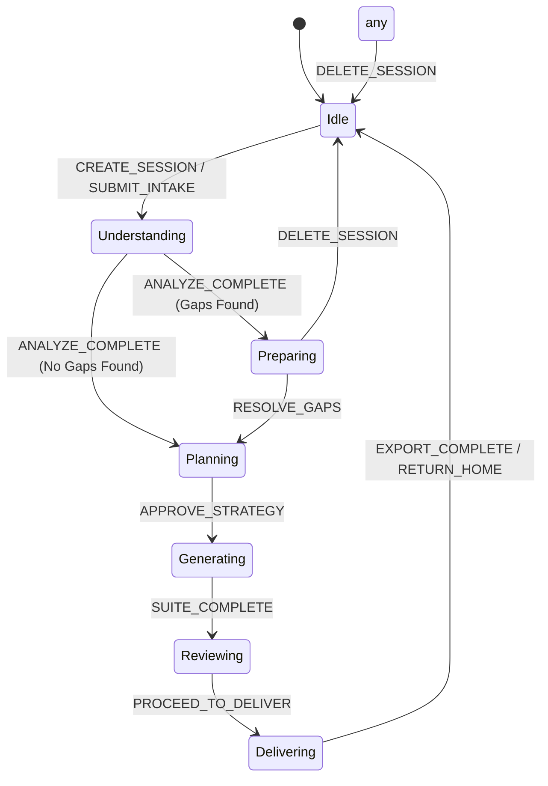

# QAMate v1 State Machine ⚙️

This document specifies the internal state machine governing a single QAMate analysis session, detailing states, allowed transition triggers, and the fail-safe offline fallback paths.

---

## 1. Session Aggregate States

The workspace session aggregate operates across seven main states matching the outcome steps:



---

## 2. State Transition Reference

| Source State | Event Trigger | Target State | Action / Visual Effect |
| :--- | :--- | :--- | :--- |
| `Idle` | `SUBMIT_INTAKE` | `Understanding` | Runs AST rules parser & domain detection. Renders progress skeleton. |
| `Understanding` | `ANALYZE_COMPLETE` (Gaps Found) | `Preparing` | Loads QA Readiness Panel. Displays blocking questions. |
| `Understanding` | `ANALYZE_COMPLETE` (No Gaps) | `Planning` | Bypasses QA Readiness. Loads Test Strategy Panel. |
| `Preparing` | `RESOLVE_GAPS` | `Planning` | User answered or acknowledged skip risks. Generates strategy metrics. |
| `Planning` | `APPROVE_STRATEGY` | `Generating` | Compiles context parameters and triggers Test Cases Factory. |
| `Generating` | `SUITE_COMPLETE` | `Reviewing` | Compiles deliverables. Opens Results Workspace (Tabbed view). |
| `Reviewing` | `PROCEED_TO_DELIVER` | `Delivering` | Locks test cases from edits. Displays export format downloaders. |
| `Delivering` | `RETURN_HOME` | `Idle` | Wipes active memory cache. Returns user to Home. |

---

## 3. Offline-First & Fail-Safe Heuristics Path

If there is no active internet connection, or if AI connections are set to `Offline` (the default mode), the state machine remains fully functional:

```mermaid
graph LR
    NoAI[No AI Key / Offline] ➔ Heuristics[Local Rule Engine] ➔ StateTransitions[Normal Transitions Keep Working]
```

- **Heuristic Analyzer**: Operates using static regex and AST pattern analyzers (does not block on external LLM calls).
- **Static Domain Detection**: Operates using keyword arrays matching Payments, Auth, CRM, etc.
- **Fail-Safe QA Readiness**: Loads predefined validation templates based on detected domain rules.
- **Static Exclusions & Case Factories**: Generates checklist test cases from structured heuristic files.
- **Result & State Persistence**: All state variables and outcomes serialize locally via the conversation manager.
