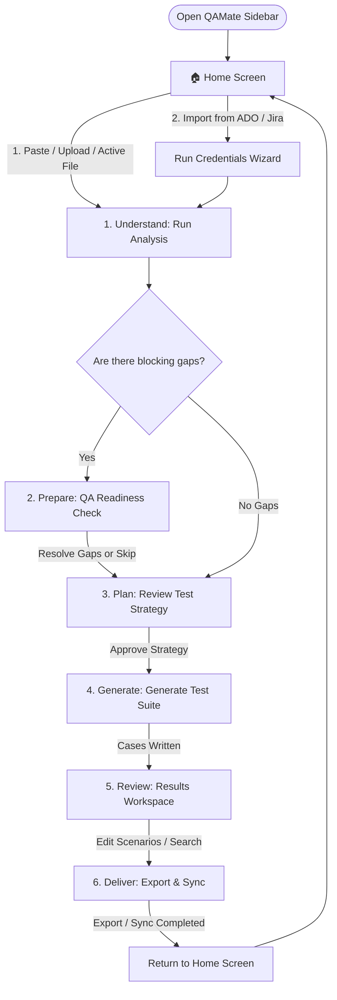

# QAMate v1 User Flows 🗺️

This document describes the user navigation paths, decisions, and system transition flows across the six outcome states of QAMate.

---

## 1. Primary Workspace Flow

The core user experience is structured around the two main paths: the **Gap-Free Path** (which skips QA Readiness entirely) and the **Gap-Detected Path** (which prompts for readiness questions).

---

## 2. Navigation Rules

Users can transition between the main destinations via the 4-item global navigation bar.

### A. Home (🏠)
- The starting point for all new workflows.
- Contains the intake area and system status.
- Resumes a session from the recent sessions list, which routes the user directly to the last saved outcome state (e.g., if the user was on the Strategy approval phase, they resume directly into **Plan**).

### B. Sessions (📂)
- Displays full history of QAMate sessions.
- **Allowed Actions**:
  - **Resume**: Re-opens the workspace at the last active outcome.
  - **Rename**: Edits the session label.
  - **Duplicate**: Clones the session context (spec + answered questions + strategy) to try alternative paths.
  - **Delete**: Wipes session database entry and local caching.

### C. Settings (⚙)
- Exposes connection managers and workspace preferences.
- Allows toggling **Developer Mode**. When enabled, the Developer overlay becomes available on all outcome screens.

### D. Help (❓)
- Bypasses the active session and renders getting-started documentation, keyboard hotkey references, and troubleshooting links.

---

## 3. Outcome Transition Rules

1. **Understand ➔ Prepare**: Transition occurs automatically if the engine identifies missing parameters (e.g., database models, vague terms, missing acceptance criteria).
2. **Prepare ➔ Plan**: The user must either answer the blocking questions or acknowledge the skip risks to proceed.
3. **Plan ➔ Generate**: The user must explicitly click "Approve Strategy" to unlock test case generation.
4. **Generate ➔ Review**: The UI displays real progress skeletons during test generation and redirects to the preview tabs upon completion.
5. **Review ➔ Deliver**: Direct transition occurs when the user clicks "Proceed to Deliver" from the Results view.
